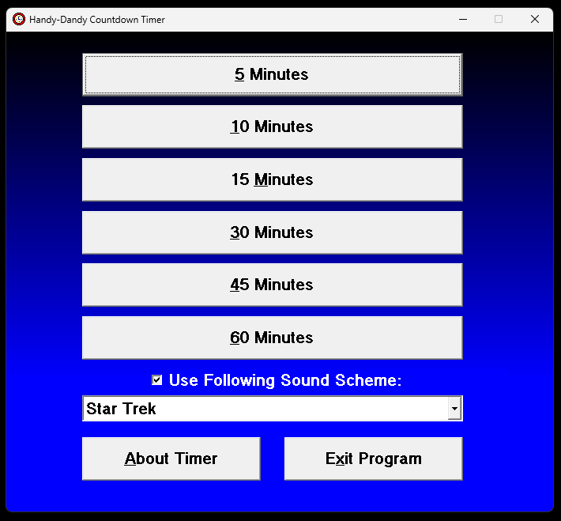
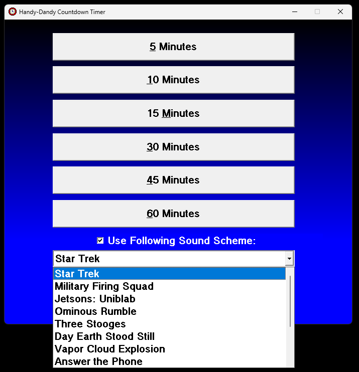
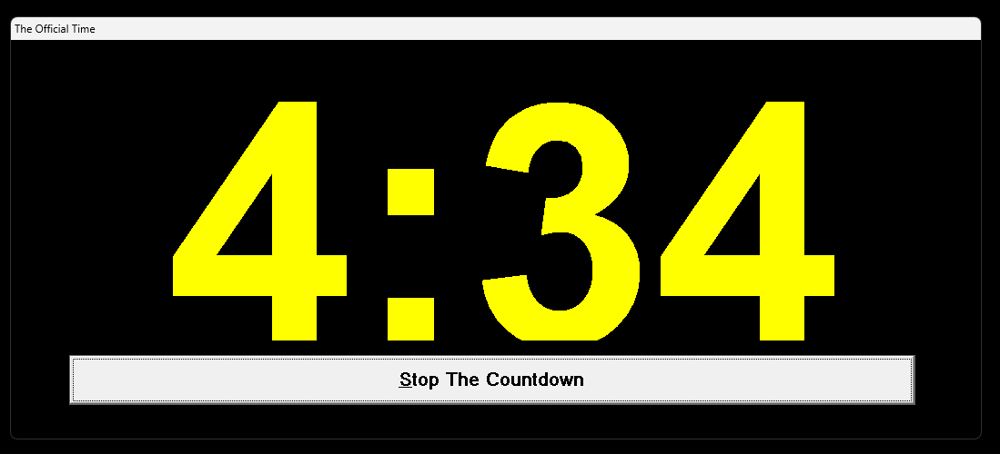
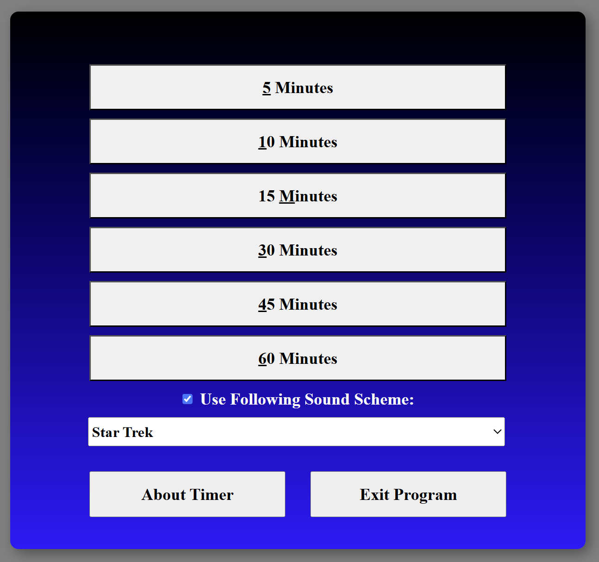
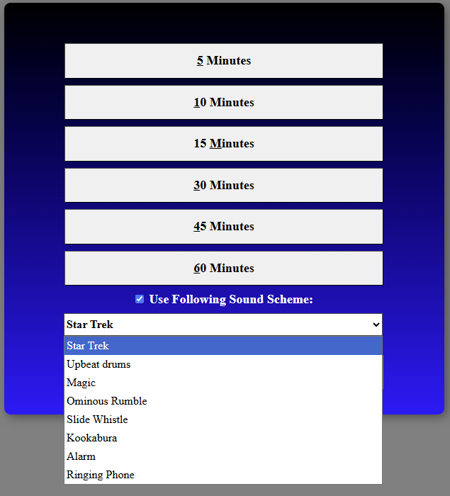
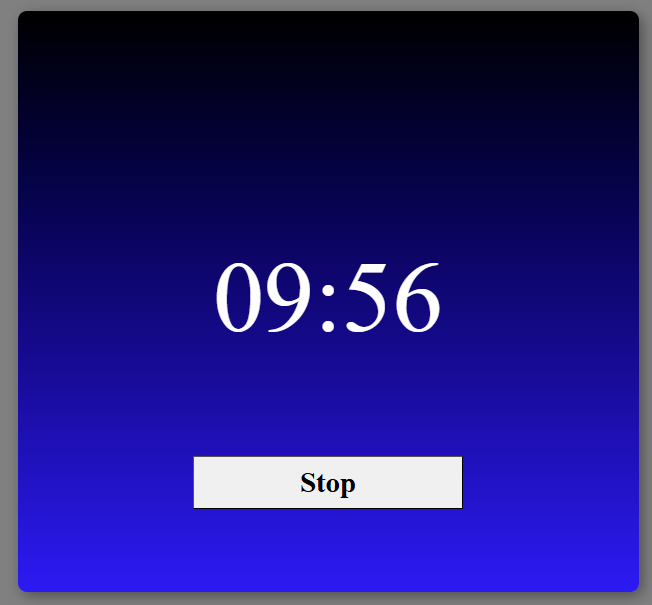

# Countdown Timer

A simple browser-based countdown timer built with HTML, CSS, and JavaScript. I found an old timer.exe file on a shared drive, and after I reviewed the program, I decided to recreate it as closely to the original as possible. 
The screenshots below are from the original program.

## Screenshots of the original program:




## Screenshots of the recreated program



## Features

- Start, pause, and reset the timer
- Set a custom duration
- Play alert sounds from the `sounds/` folder

## Quick start

1. Open `index.html` in your browser (double-click the file or serve the project folder with a static server).
2. Use the on-screen controls to set the time and start the countdown.

## Files

- `index.html` — Application entry point and UI
- `index.js` — Timer logic and event handlers
- `timer.css` — Styles for the UI
- `sounds/` — Folder containing alert audio files

## Development / Notes

- There is no build step. Edit the files and refresh the browser to see changes.
- To serve the folder via a simple HTTP server (recommended for some browsers), you can use Python:

	Windows PowerShell:

	```powershell
	python -m http.server 8000
	```

	Then visit `http://localhost:8000` in your browser.

## Contribution

Contributions and improvements are welcome. Open an issue or submit a pull request describing your changes.

## License

This project is available under the MIT License.